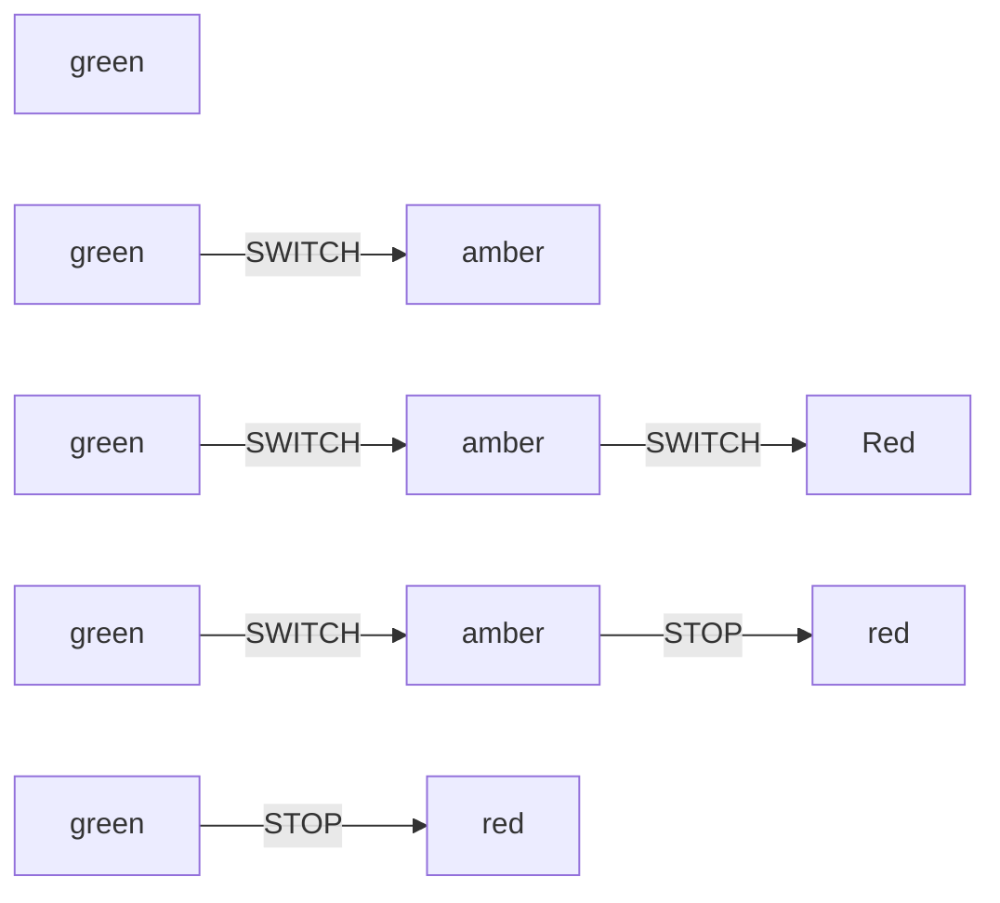

Model-based testing is the process of creating a model (an abstract version) of the behaviour of a system. Then executing the model so it is run over an implementation. Then validating that the system under tests behaves the same way as the model.

Before we start there are multiple types of model-based test. The one we will explore is state chart powered model-based testing. This is an early exploration of the ideas around model based testing and as such will develop over time.

I will start by introducing the pieces of a model-based test and how they fit together, then go through what is being tested.

### What do we need for a model-based test

To write a model based test for a component, you need a state chart. This state chart will define the states of your component, and the events that transfer between the states.  


Then from the state chart you are able to generate a series of paths, that step through through each state via an action. The above state chart generates the following paths:



Once we have the paths we need a way of interacting with the component to trigger the events that are on each step of the path. This is where something like a `*-testing-library` is very useful. We can say given the state is `Green` and when the event is `Switch` then find the Switch button on the page a press it. 

A lookup can work here:

```js
const interactions = {
  green: {
    SWITCH: container => 
      fireEvent.click(getByText(container, "Switch"))
  }
};
```

This leaves us with the job of validating that we are in the correct state after each event. This is where we use the testing library to confirm that we are in the state we expect.

```js
const compare = {
  green: container => 
    expect(getByTestId(container, "state-value").innerText).toBe("green");
};
```

Run your tests iterating through each path and you will cover the routes through your application.

### But what got tested?

